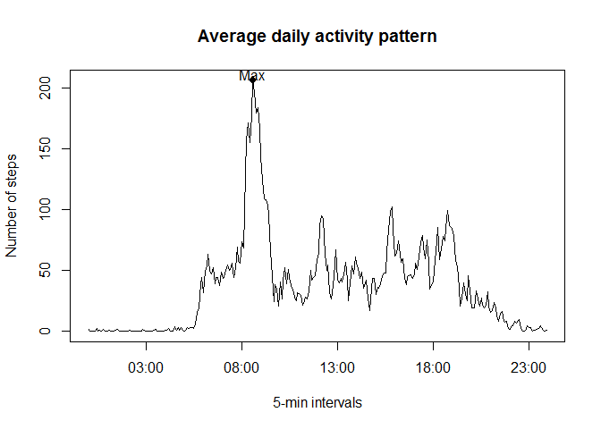
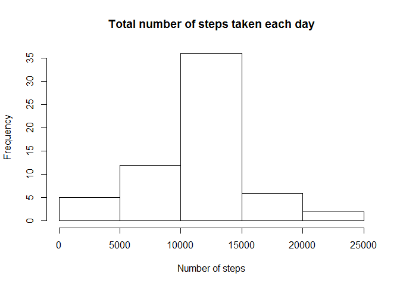

# Reproducible Research: Peer Assessment 1

This is a report analyzing the data from a personal activity monitoring device. This device collects data at 5 minute intervals through out the day. The data consists of two months of data from an anonymous individual collected during the months of October and November, 2012 and include the number of steps taken in 5 minute intervals each day.


## Loading and preprocessing the data
First, unzip and load the activity monitoring data.

```r
unzip("./activity.zip")
act <- read.csv("./activity.csv")
```

## What is mean total number of steps taken per day?
Calculate the total number of steps taken each day.  Here, we ignore the missing values in the dataset.

```r
library(dplyr)
```

```
## Warning: package 'dplyr' was built under R version 3.1.3
```

```
## 
## Attaching package: 'dplyr'
## 
## The following object is masked from 'package:stats':
## 
##     filter
## 
## The following objects are masked from 'package:base':
## 
##     intersect, setdiff, setequal, union
```

```r
daily <- group_by(act, date)
dailySum <- summarize(daily, dailySteps = sum(steps, na.rm=TRUE))
```

Here is the histogram of the total number of steps taken each day.

```r
hist(dailySum$dailySteps, xlab="Number of steps", main="Total number of steps taken each day")
```

 

Here are the mean and median total number of steps taken per day.

```r
mean(dailySum$dailySteps)
```

```
## [1] 9354.23
```

```r
median(dailySum$dailySteps)
```

```
## [1] 10395
```

## What is the average daily activity pattern?
Calculate the average number of steps taken for each 5-minute interval, averaged across all days. Here, we ignore the missing values in the dataset.

```r
intervals <- group_by(act, interval)
intervals <- summarize(intervals, steps=mean(steps, na.rm=TRUE))
```

Here is the time series plot of the 5-minute interval and the average number of steps taken.

```r
plot(intervals$interval, intervals$steps, type="l", 
     xlab="5-min intervals", ylab="Number of steps", main="Average daily activity pattern")
```

 

Find out which 5-minute interval, on average across all the days in the dataset, contains the maximum number of steps.

```r
ind <- which.max(intervals$step)
mInt <- intervals$interval[ind]
mSteps <- intervals$steps[ind]
```
The interval 835 contains the maximum number of steps, 206.1698113.


## Imputing missing values
Calculate the total number of missing values in the dataset.

```r
sum(is.na(act$steps))
```

```
## [1] 2304
```

We will fill in a missing value in the dataset with the mean for that 5-minute interval, which we calculated earlier.  A new dataset is created that is equal to the original dataset but with the missing data filled in.

```r
act1 <- arrange(merge(act, intervals, by.x="interval", by.y="interval"), date)
act1 <- transmute(act1, steps=ifelse(is.na(steps.x), steps.y, steps.x), date=date, interval=interval)
```

Calculate the total number of steps taken each day for the new dataset.

```r
daily <- group_by(act1, date)
dailySum <- summarize(daily, dailySteps = sum(steps, na.rm=FALSE))
```

Here is the histogram of the total number of steps taken each day for the new dataset.

```r
hist(dailySum$dailySteps, xlab="Number of steps", main="Total number of steps taken each day")
```

 

Here are the mean and median total number of steps taken per day for the new dataset.

```r
mean(dailySum$dailySteps)
```

```
## [1] 10766.19
```

```r
median(dailySum$dailySteps)
```

```
## [1] 10766.19
```

Compare to the orginal dataset, the new dataset with missing data filled in results in fewer days with low numbers of steps taken. The mean and median are higher with the new dataset.  It is apparent that the missing values are concentrated in certain days, instead of spreading across most days.

## Are there differences in activity patterns between weekdays and weekends?
Calculate average number of steps taken for each 5-minute interval, averaged across all weekday days or weekend days.

```r
act1$weekday = factor(ifelse(weekdays(as.Date(act1$date)) %in% c("Saturday","Sunday"), "weekend", "weekday"))

intervals1 <- group_by(act1, interval, weekday)
intervals1 <- summarize(intervals1, steps=mean(steps))
```

Here is the panel plot containing a time series plot of the 5-minute interval and the average number of steps taken.

```r
library(lattice)
```

```
## Warning: package 'lattice' was built under R version 3.1.3
```

```r
xyplot(intervals1$steps ~ intervals1$interval | intervals1$weekday , type="l", layout=c(1,2),
       xlab="Interval", ylab="Number of steps")
```

 
